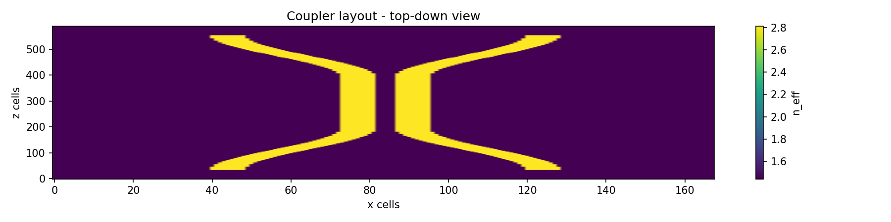
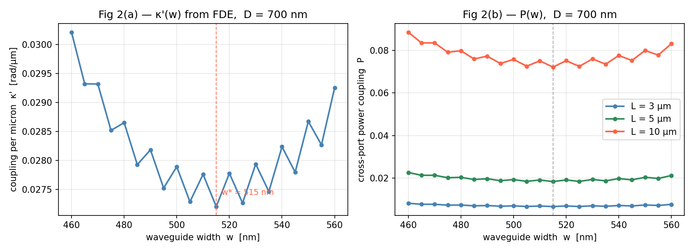
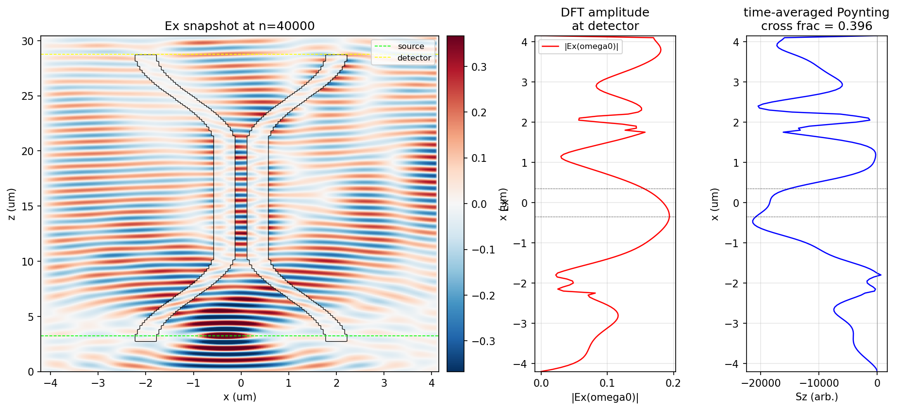
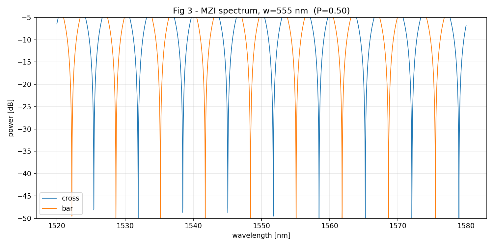
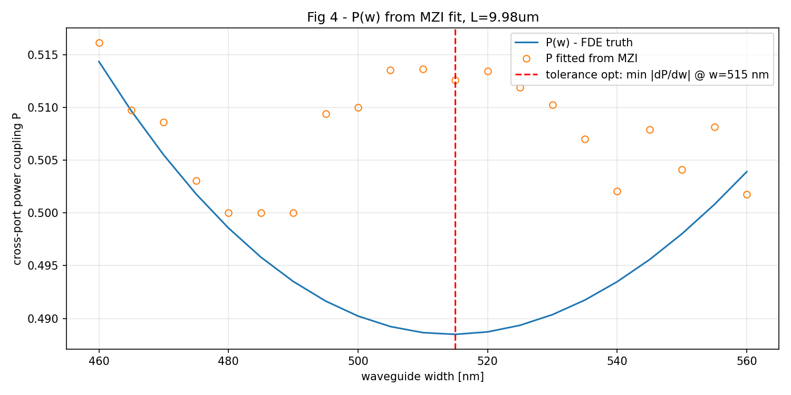

# Fabrication-Tolerant Directional Coupler

A from-scratch Python framework to design and validate a **fabrication-tolerant directional coupler** on a silicon photonics platform — including a hand-written 2D FDTD electromagnetic solver, an eigenmode (FDE) analysis, a coupled-mode model, and a Mach-Zehnder interferometer (MZI) measurement model.

**Headline result:** four independent methods converge on the same fabrication-tolerant waveguide width of **w\* ≈ 515 nm**, where the coupler's split ratio becomes insensitive to manufacturing width errors of up to **±35 nm**.

No commercial photonics software (Lumerical etc.) was used — everything is built on NumPy, SciPy, and Matplotlib.

> Based on the design principle in Y. Liu, U. Khan, W. Bogaerts, *"Fabrication Tolerant Directional Coupler"*, ECIO 2023 (Ghent University–imec). This is an independent computational reproduction and validation.

---

## The problem

A directional coupler (DC) splits light between two waveguides and sits inside almost every photonic component. In high index-contrast silicon, the optical mode is tightly confined, which makes the coupling **exponentially sensitive to the waveguide width** — a few-nm fabrication error shifts the split ratio significantly, and that error propagates through every component built on the DC.

## The tolerance principle

As the waveguide width `w` increases, two competing effects act on the coupling:

- **Stronger confinement** → less light leaks across → **less** coupling.
- **Smaller gap** `g = D - w` (centre-spacing `D` held fixed) → waveguides closer → **more** coupling.

At a balance width `w*`, the two effects cancel, and the coupling becomes flat with respect to width — the fabrication-tolerant point.

The coupler geometry (top-down): two waveguides enter apart, curve together via S-bends into the straight coupling section, then curve back apart.



---

## Three methods, one answer

| | FDE | FDTD | MZI |
|---|---|---|---|
| **What** | eigenmode solve of the cross-section | full time-domain Maxwell simulation | measurement model |
| **Speed** | fast | slow (~160 s/run) | fast |
| **Bends** | straight section only | whole device, bends included | n/a |
| **Approximation** | coupled-mode | none (solves Maxwell directly) | lossless 2×2 transfer matrix |
| **Output** | `kappa'(w)` | cross-coupling `P` of full device | `P` from fringe contrast |
| **Role** | locate `w*` quickly | validate the physics exactly | confirm it's measurable on a real chip |

**FDE** finds the two supermodes of the coupled cross-section; their effective-index splitting gives the coupling per unit length:

```
kappa' = pi * (n_s - n_a) / lambda
```

**FDTD** is a 2D TE solver written from scratch — Yee leapfrog scheme, CPML absorbing boundaries, and frequency-domain power extraction via an in-loop DFT. It simulates the complete coupler including S-bends with no coupled-mode approximation.

**MZI** models how coupling is extracted experimentally: two identical DCs in an interferometer produce fringes whose depth (`4·P·(1-P)`) encodes `P`, independent of the grating-coupler transmission that contaminates a direct measurement.

---

## Results

**FDE width sweep** — `kappa'(w)` shows a clear minimum, and the coupled-mode power `P(w)` flattens at the same width for all coupler lengths (3, 5, 10 µm):



**FDTD** — full electromagnetic field of the coupler. Light launched into one waveguide couples across to the other; DFT-extracted Poynting flux gives a cross fraction ≈ 0.40, matching the paper's measured range:



**MZI spectrum** — complementary bar/cross interference fringes with deep extinction notches; fringe depth encodes the coupling:



**MZI extraction** — fitting fringe contrast across widths recovers `P(w)` with the tolerance minimum at ~515 nm:



All four paths — FDE `kappa'(w)`, coupled-mode `P(w)`, FDTD, and the MZI fit — agree on **w\* ≈ 515 nm**, within a few nm of the paper's simulation and measurement.

---

## Project structure

```
coupler/
  materials.py     refractive index models (Si, SiO2, air) via Sellmeier dispersion
  geometry.py      trapezoidal cross-section, permittivity map, grid helpers
  mode_solver.py   FDE supermode solver (EMpy), kappa' from index splitting
  coupling.py      coupled-mode power model + lossless MZI transfer matrix
  fdtd.py          hand-written 2D TE FDTD: Yee + CPML + DFT power extraction
inspect_geometry.py   plot the cross-section index map
sweep_fde.py          FDE width sweep -> fig2_fde_sweep.png
mzi_figures.py        MZI spectra + P(w) fit -> fig3, fig4
```

## Platform & parameters

- Platform: imec iSiPP50G silicon photonics
- Thickness `t` = 214 nm, centre spacing `D` = 700 nm, sidewall angle ≈ 85°
- Width `w` swept 460–560 nm, wavelength `lambda` = 1550 nm, TE polarization
- FDTD grid: 50 nm, Courant 0.70, 40,000 steps, CPML (15 cells/side)

---

## Installation & usage

```bash
# clone
git clone https://github.com/zeddology/fabrication-tolerant-directional-coupler.git
cd fabrication-tolerant-directional-coupler

# environment (conda recommended)
conda create -n dc-tolerant python=3.11 numpy scipy matplotlib -c conda-forge
conda activate dc-tolerant
pip install EMpy        # full-vectorial FDE mode solver

# run
python inspect_geometry.py     # cross-section index map
python sweep_fde.py            # FDE kappa'(w) + CMT P(w)  -> fig2
python mzi_figures.py          # MZI spectra and P(w) fit  -> fig3, fig4
# FDTD is driven from fdtd.py (see the run example in the module)
```

---

## Limitations & future work

- The FDTD uses a **constant bend contribution** `kappa_0`; the paper's experimental `P(w)` varies more because real bends couple width-dependently. Extracting `kappa_0(w)` from FDTD of the bends would close this gap.
- FDTD accuracy is set by the **50 nm grid** — a finer grid (20–25 nm) would sharpen `kappa'` at higher runtime cost.
- Next steps: width-dependent bend coupling, finer grids for sub-nm precision on `w*`, and combining tolerance with broadband operation.

## Reference

Y. Liu, U. Khan, W. Bogaerts, *"Fabrication Tolerant Directional Coupler"*, 24th European Conference on Integrated Optics (ECIO), 2023.

